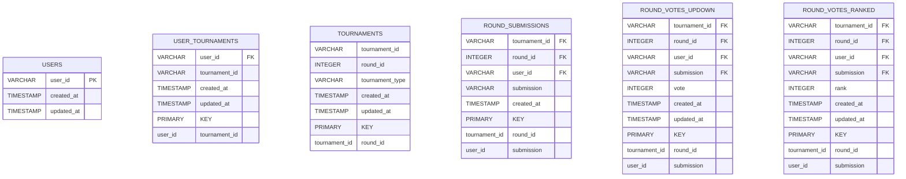

# Schema

```mermaid
erDiagram
    USERS {
        VARCHAR user_id PK
        TIMESTAMP created_at
        TIMESTAMP updated_at
    }

    USER_TOURNAMENTS {
        VARCHAR user_id FK
        VARCHAR tournament_id
        TIMESTAMP created_at
        TIMESTAMP updated_at
        PRIMARY KEY user_id tournament_id
    }

    TOURNAMENTS {
        VARCHAR tournament_id
        INTEGER round_id
        VARCHAR tournament_type
        TIMESTAMP created_at
        TIMESTAMP updated_at
        PRIMARY KEY tournament_id round_id
    }

    ROUND_SUBMISSIONS {
        VARCHAR tournament_id FK
        INTEGER round_id FK
        VARCHAR user_id FK
        VARCHAR submission
        TIMESTAMP created_at
        PRIMARY KEY tournament_id round_id user_id submission
    }

    ROUND_VOTES_UPDOWN {
        VARCHAR tournament_id FK
        INTEGER round_id FK
        VARCHAR user_id FK
        VARCHAR submission FK
        INTEGER vote
        TIMESTAMP created_at
        TIMESTAMP updated_at
        PRIMARY KEY tournament_id round_id user_id submission
    }

    ROUND_VOTES_RANKED {
        VARCHAR tournament_id FK
        INTEGER round_id FK
        VARCHAR user_id FK
        VARCHAR submission FK
        INTEGER rank
        TIMESTAMP created_at
        TIMESTAMP updated_at
        PRIMARY KEY tournament_id round_id user_id submission
    }

```